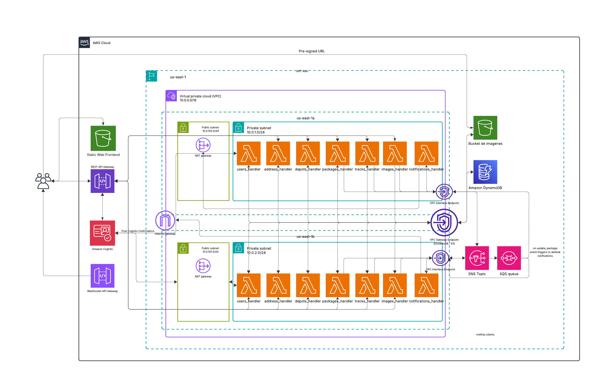

# Cloud Computing TP - Fast Track Delivery

This repository contains the Terraform code for our "Fast Track Delivery" project. This code deploys a 100% serverless architecture on AWS, which replaces our previous EC2-based monolithic application.

## Target Architecture

We are building the following event-driven, serverless architecture:



## Prerequisites

Before you begin, ensure you have the following tools installed and configured:

1.  **Terraform:** [Install Guide](https://learn.hashicorp.com/tutorials/terraform/install-cli)
2.  **AWS CLI:** [Install Guide](https://docs.aws.amazon.com/cli/latest/userguide/cli-chap-install.html)
3.  **AWS Credentials:** Your AWS CLI must be configured with valid credentials (`aws configure`).
4.  **Python 3 & Pip:** Required to run the deployment scripts and package Lambda functions.
5.  **Node.js & npm:** Required to install dependencies and build the React frontend application.
6.  **Git:** Required to clone the frontend application repository during deployment.


### AWS Credentials Verification
Your AWS CLI must be configured with valid credentials (aws configure). Verify your credentials are valid:

```sh
aws sts get-caller-identity
```

## Project Structure

The infrastructure is organized into logical modules:

* `/modules/dynamodb`: Defines the reusable module that creates DynamoDB databases according to the parameters set in the main configuration.
* `/modules/lambda-api`: Creates Lambda functions for the API backend.
* `/modules/s3-bucket`: Defines the reusable module that creates S3 buckets for static file storage according to the parameters set in the main configuration.

## How to Deploy

The deployment process is automated through platform-specific scripts that handle Lambda packaging, Terraform execution, output retrieval, and frontend deployment.
The deployment script requires one argument: the environment (dev or prod).

### 1. Execute the Deployment Script
All deployment commands must be executed from the root directory of the project. Use the appropriate command based on your operating system:

For Windows:
```sh
python scripts/deploy_all.py <dev|prod>
```

For macOS / Linux:
```sh
python3 -m venv venv
source venv/bin/activate
sh ./scripts/main_deploy.sh <dev|prod>
```

The script performs the following actions sequentially:
- Package Lambdas: Zips the backend code and its dependencies.
- Terraform Init/Apply: Initializes Terraform in the envs/<env> directory and executes apply -auto-approve.
- Deploy Frontend: Clones the React repository, injects the API URL output from Terraform, builds the application, and uploads it to the S3 frontend bucket using the AWS CLI.

### 2. Verify Deployment
```sh
# Change to the appropriate Terraform directory (e.g., envs/dev)
cd envs/dev

# See outputs
terraform output
```

### 3. Destroy deployment
To destroy all AWS resources created by Terraform, you must first manually empty the S3 buckets.
Caution: Ensure you are in the correct envs/<env> directory before running terraform destroy.
```sh
# Empty S3 buckets
aws s3 rm s3://fast-track-delivery-serverless-images-bucket --recursive
aws s3 rm s3://fast-track-delivery-serverless-frontend-bucket --recursive

# Destroy all
terraform destroy
```
Write `yes` when asked
